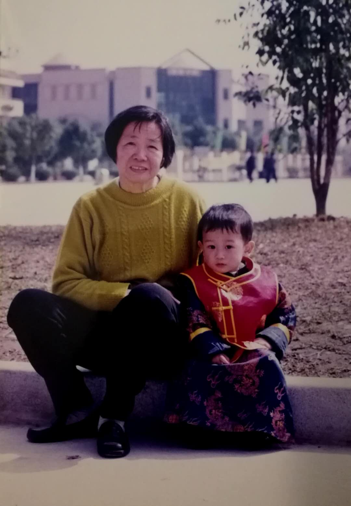

# Kai Huang
> Everyone has many people that are very important to them in the process of growing up, and many of them have acted as our discourse sponsors in some way and help us shape our personality to become who we are right now.

For me, my grandmother might probably be the person who has the most influence on me beside my parents. When I was little, my parents were very busy at work and they always came home very late at night, and I was mainly taking care by my grandmother because I was the youngest one among eight of her grandchildren. I was weak and thin compared to other kids in my age because I was born one month before the expected date of confinement, so she always tried her best to make healthy and nutritious foods for me.

