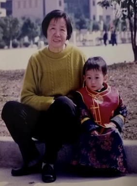
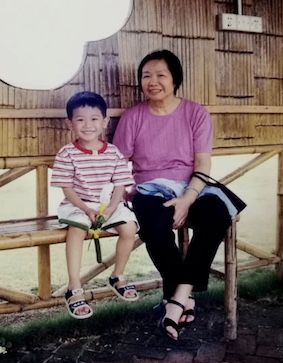

# Kai Huang
> Everyone has many people that are very important to them in the process of growing up, and many of them have acted as our discourse sponsors in some way and help us shape our personality to become who we are right now.

For me, my grandmother might probably be the person who has the most influence on me beside my parents. When I was little, my parents were very busy at work and they always came home very late at night, and I was mainly taking care by my grandmother because I was the youngest one among eight of her grandchildren. I was weak and thin compared to other kids in my age because I was born one month before the expected date of confinement, so she always tried her best to make healthy and nutritious foods for me.

>Picture of me and my grandmother when I was little.

           

I remember I always asked my grandmother: _“Why does everything taste so light and without too much salt and oil in it? Why do we always eat fish? Why do we always drink all these different types of soup?”_

My grandma would always answer that: _“Eating too much salt and oil is not good for your body; Fishes are good for your brain, and you will be smarter; All the different soup I made are good for your body and they were meant to strengthen your body.”_

Under the influence of my grandmother’s eating habit, I always pay attention of what I should eat more and try to control what I should eat less.

My grandmother not only has huge influence on my eating habit, but she also teaches me many other things. Although Mandarin is the official language in China and what other people from different countries refer as Chinese language, Cantonese is the dominant language in my hometown and has the second most speaker in China. My grandmother only speaks Cantonese, so I have to speak Cantonese to her, which “force” me to speak more and my Cantonese improved a lot because of that. She also taught me to become a better person overall, such as be polite and nice to other people, learn to frugal, and try to become independent.

>Pictures of her 80th Birthday.

           

My grandmother always says to me: **“I am happy when you are happy.”**, which means nothing to the younger me because I did not understand the meaning, but to me right now it means how much she loves and cares about me. She had her 80th birthday celebration this year with her children, grandchildren, and even great-grandchildren. In China, 80th birthday is a very big deal for family, and I am so regret that I cannot celebrate with her, but I am still very grateful that I have one of the best grandmothers in the world.
